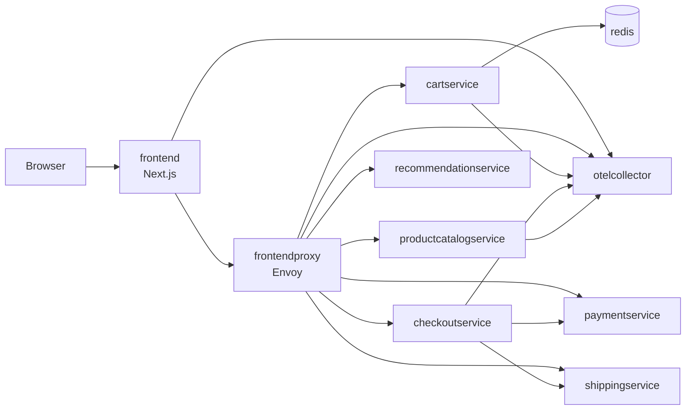
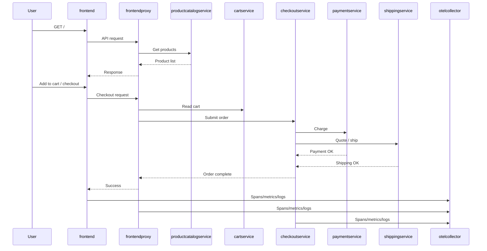

# Section 10 — Containerization and Docker Compose Learning Lab

> Hands-on Docker and Docker Compose training in the OpenTelemetry-style microservices context, designed to prepare you for CI/CD, ACR publishing, and AKS deployment.

---

## 10.1 Learning Outcomes

By the end of this chapter, you can:

- Build a service image from a real multi-service repository.
- Explain image vs container and why immutable artifacts matter.
- Run and debug services with Docker Compose in a dependency-aware flow.
- Read and modify multi-stage Dockerfiles (deps, builder, runner).
- Troubleshoot common local issues (OOM, ports, distroless shell, DNS, WSL2 collector settings).
- Use local overrides without polluting base compose for CI/CD.
- Optimize build cache usage and reduce image size.
- Prepare consistent image tags for CI pipelines and ACR.
- Map local container workflow to AKS deployment workflow.

---

## 10.2 Why Containerization for Microservices

In this project, services use different languages and runtimes (Go, Java, Node.js, Python, .NET, Rust, Ruby, PHP). Containers give one consistent execution contract.

### Core Concepts

- Image: read-only package containing app code, runtime, dependencies, metadata, and startup command.
- Container: running instance of an image with isolated process/network/filesystem context.
- Immutable artifact: build once, promote unchanged artifact across environments.
- Environment parity: local, CI runners, and AKS use the same container image.

Why this reduces "works on my machine":
- You stop relying on host-specific runtime versions and local package state.
- CI validates the same artifact that AKS later pulls from ACR.

CI/CD and AKS connection:
1. Build image in CI.
2. Scan and tag image deterministically.
3. Push to ACR.
4. Deploy exact tag/digest to AKS.

> [!TIP]
> Prefer immutable tags for promotion (for example `service:<git-sha>`) and treat mutable tags (`latest`) as local/dev convenience only.

---

## 10.3 Example System Context

### Service groups in this repo style

- Frontend and edge:
  - `frontend` (Next.js UI + API routes)
  - `frontendproxy` (Envoy edge/proxy behavior)
- Backend business services:
  - `cartservice`, `checkoutservice`, `paymentservice`, `productcatalogservice`, `recommendationservice`, `shippingservice`, `adservice`, and others
- Messaging/data dependencies:
  - `redis` and other backing services used by business components
- Observability stack:
  - `otelcollector` plus downstream tracing/metrics backends

### Frontend service model

The `frontend` service is a Next.js application with two layers:

- Client-side UI layer: renders the web storefront.
- API layer: exposes REST endpoints and forwards requests to backend services.

### Architecture diagram



### Request-flow diagram



---

## 10.4 Dockerfile Deep Dive (Multi-Stage)

Most services should use a pattern that separates dependency install, build, and minimal runtime.

### Annotated example

```dockerfile
# syntax=docker/dockerfile:1.7

# ---- dependencies stage ----
FROM node:20-alpine AS deps
WORKDIR /app
COPY package*.json ./
RUN npm ci

# ---- builder stage ----
FROM deps AS builder
ARG NEXT_PUBLIC_API_BASE=/api
ENV NEXT_PUBLIC_API_BASE=${NEXT_PUBLIC_API_BASE}
COPY . .
RUN npm run build

# ---- minimal runtime stage ----
FROM gcr.io/distroless/nodejs20-debian12 AS runner
WORKDIR /app
ENV NODE_ENV=production
COPY --from=builder /app/.next ./.next
COPY --from=builder /app/public ./public
COPY --from=builder /app/package.json ./package.json
EXPOSE 8080
ENTRYPOINT ["node"]
CMD ["server.js"]
```

How to read each block:
- Dependencies stage: caches package install and avoids reinstall on every source change.
- Builder stage: compiles/transpiles app artifacts.
- Minimal runtime stage: carries only runtime files and startup command.

Distroless images:
- Benefits: smaller attack surface, fewer CVEs, smaller image footprint.
- Limitation: no shell/package manager.
- Expected behavior: `docker exec -it <container> sh` fails because `sh` is absent.

> [!WARNING]
> Do not assume shell-based debugging inside production distroless containers. Use logs, metrics, traces, and a debug/builder image when interactive shell access is needed.

Instruction usage in this context:
- `EXPOSE`: documents intended in-container port.
- `ENTRYPOINT`: fixed executable.
- `CMD`: default args passed to entrypoint.
- `ARG`: build-time config only.
- `ENV`: runtime config available in container process.

### 10.4.1 How to choose Docker images for different application stacks

Use this decision flow each time you containerize a service:

1. Pick a trusted image source.
2. Pick a builder image that includes full toolchain.
3. Pick a minimal runtime image that only runs the built artifact.
4. Pin image tags (or digest) for reproducibility.

Recommended trusted image sources:
- Official language images on Docker Hub (for example `python`, `golang`, `node`, `eclipse-temurin`).
- Microsoft Container Registry for .NET (`mcr.microsoft.com/dotnet/*`).
- Distroless runtime images (`gcr.io/distroless/*`) when shell-less runtime is acceptable.

> [!TIP]
> Prefer exact version tags such as `python:3.12-slim` or `mcr.microsoft.com/dotnet/sdk:8.0` over floating tags like `latest`.

Language-specific starting points:

| Stack | Builder image | Runtime image | Why |
|---|---|---|---|
| C#/.NET | `mcr.microsoft.com/dotnet/sdk:8.0` | `mcr.microsoft.com/dotnet/aspnet:8.0` | SDK image compiles/publishes; ASP.NET runtime is smaller |
| Go | `golang:1.22-alpine` | `gcr.io/distroless/static:nonroot` or `alpine:3.20` | Build static binary, then run in minimal runtime |
| Python | `python:3.12-slim` | `python:3.12-slim` (or distroless python) | Many apps need Python runtime + wheels/system libs |

#### C# (.NET) template

```dockerfile
FROM mcr.microsoft.com/dotnet/sdk:8.0 AS build
WORKDIR /src
COPY *.sln ./
COPY src/MyService/*.csproj src/MyService/
RUN dotnet restore src/MyService/MyService.csproj
COPY . .
RUN dotnet publish src/MyService/MyService.csproj -c Release -o /app/out

FROM mcr.microsoft.com/dotnet/aspnet:8.0 AS runtime
WORKDIR /app
COPY --from=build /app/out .
EXPOSE 8080
ENTRYPOINT ["dotnet", "MyService.dll"]
```

Why this pattern:
- `sdk` image is large but needed for restore/build/publish.
- `aspnet` runtime image is smaller and production-oriented.

#### Go template

```dockerfile
FROM golang:1.22-alpine AS build
WORKDIR /src
COPY go.mod go.sum ./
RUN go mod download
COPY . .
RUN CGO_ENABLED=0 GOOS=linux GOARCH=amd64 go build -o /out/service ./cmd/service

FROM gcr.io/distroless/static:nonroot AS runtime
COPY --from=build /out/service /service
USER nonroot:nonroot
EXPOSE 8080
ENTRYPOINT ["/service"]
```

Why this pattern:
- Static binary enables very small runtime image.
- Distroless improves security posture (no shell/package manager).

#### Python template

```dockerfile
FROM python:3.12-slim AS build
WORKDIR /app
ENV PIP_NO_CACHE_DIR=1
COPY requirements.txt .
RUN pip install --prefix=/install -r requirements.txt
COPY . .

FROM python:3.12-slim AS runtime
WORKDIR /app
COPY --from=build /install /usr/local
COPY --from=build /app /app
EXPOSE 8080
CMD ["python", "app.py"]
```

Why this pattern:
- Keeps dependency installation separate from runtime startup.
- Reuses slim runtime while avoiding build-only leftovers.

Stack-specific notes:
- C# often needs restore caching by copying `.csproj` files before full source copy.
- Go benefits heavily from static builds and tiny runtime stages.
- Python often requires OS packages for some wheels; add only what is needed and keep runtime lean.

Quick checklist before finalizing base images:
- Is the builder image capable of compiling the app?
- Is runtime image minimal and production-safe?
- Are tags pinned and reproducible?
- Can the container run as non-root?
- Does the image still support required diagnostics for local debugging?

---

## 10.5 Docker Compose Deep Dive

Compose is your local microservices orchestrator.

### Key fields in this repository pattern

- `services`: each app/dependency container.
- `build`: Docker context, target, Dockerfile.
- `image`: final tag/name.
- `ports`: host-to-container mapping.
- `environment`: runtime env values.
- `volumes`: bind mount local files/directories.
- `depends_on`: startup ordering/health dependencies.
- `networks`: shared DNS/connectivity between services.

### `build` plus `image` behavior

When both are set, compose can build locally and tag the built result with your image name. This is useful when local and CI use the same naming strategy.

### `.env` substitution

```env
IMAGE_TAG=dev
FRONTEND_PORT=8080
OTEL_EXPORTER_OTLP_ENDPOINT=http://otelcollector:4317
```

```yaml
services:
  frontend:
    image: otel-demo/frontend:${IMAGE_TAG}
    ports:
      - "${FRONTEND_PORT}:8080"
```

### Local override pattern

- `docker-compose.yml`: shared base for team/CI.
- `docker-compose.override.yml`: local-only behavior for machine-specific development.

Why this keeps CI/CD and production clean:
- base file stays deploy-focused and deterministic;
- local override adds dev ergonomics without leaking local assumptions.

Example local override:

```yaml
services:
  frontend:
    build:
      context: ./src/frontend
      target: builder
    environment:
      NODE_ENV: development
    volumes:
      - ./src/frontend:/app
      - ./pb:/app/pb

  otelcollector:
    volumes:
      - ./config/otel-collector.wsl2.yaml:/etc/otelcol-contrib/config.yaml:ro
```

> [!TIP]
> Keep override files out of CI pipelines unless intentionally testing dev-mode behavior.

---

## 10.6 Hands-on Lab

Run commands from your `opentelemetry-demo` fork root.

### Step 1: Build one service image

```bash
docker compose build frontend
```

Verification:
- Build completes with no Dockerfile/dependency errors.
- You see a final naming/export step.

Expected pattern:

```text
[+] Building ... done
 => naming to ...frontend... done
```

### Step 2: Run service container

```bash
docker compose run --rm frontend node -v
```

Verification:
- Node version prints and container exits with code 0.

### Step 3: Enter shell for non-distroless image

```bash
docker compose run --rm --entrypoint sh frontend
```

Inside shell:

```bash
npm -v
exit
```

Verification:
- Interactive prompt appears.
- npm version prints.

### Step 4: Start dependency set with compose

```bash
docker compose up -d redis otelcollector productcatalogservice cartservice
```

Verification:

```bash
docker compose ps
```

Expected:
- Selected containers are `Up`.
- No rapid restart loop.

### Step 5: Run frontend in dev mode

Base local-development command from the project README style:

```bash
docker compose run --service-ports \
  -e NODE_ENV=development \
  --volume $(pwd)/src/frontend:/app \
  --volume $(pwd)/pb:/app/pb \
  --user node \
  --entrypoint sh frontend
```

If this fails on Docker Desktop + WSL2 (common with distroless/runtime target or Turbopack write issues), use this stable command:

```bash
docker compose run --rm \
  --publish 8080:8080 \
  -e NODE_ENV=development \
  --volume $(pwd)/src/frontend:/app \
  --volume $(pwd)/pb:/app/pb \
  --volume frontend_node_modules:/app/node_modules \
  --volume frontend_next:/app/.next \
  --entrypoint sh frontend
```

Then run inside container:

```bash
npm ci --no-audit --no-fund
npm run dev -- --webpack -p 8080
```

Verification:
- Dev server reports ready state.
- Browser opens `http://localhost:8080`.

> [!NOTE]
> The shell-based command requires a non-distroless/dev-capable image target. If your frontend runtime image is distroless, use a local compose override that builds frontend from a builder/dev target, then run `docker compose build frontend` once.

### Step 6: Verify endpoint health

From host:

```bash
curl -I http://localhost:8080
```

Verification:
- HTTP status is 200/3xx.

From container network (optional):

```bash
docker compose run --rm --entrypoint sh frontend -c "wget -qO- http://productcatalogservice:3550/ | head"
```

Verification:
- Response returns content (or service-specific payload).

### Step 7: Stop and clean up

```bash
docker compose down --remove-orphans
```

Optional deep cleanup:

```bash
docker compose down --volumes --remove-orphans
```

Verification:

```bash
docker compose ps
```

Expected:
- No running project containers.

---

## 10.7 Troubleshooting Playbook

| Symptom | Root cause | Fix | Verification |
|---|---|---|---|
| `npm ci` gets killed | OOM in Docker Desktop/WSL2 limits | Increase Docker memory, close heavy apps, retry build; reduce parallel work | Build completes; exit code 0 |
| Distroless image has no shell | Distroless excludes shell binaries by design | Use builder/dev image for shell access; debug via logs/traces | `docker exec ... sh` fails on distroless, succeeds on builder |
| Dev server port mismatch | App listens on one port but compose publishes another | Align app listen port, Dockerfile `EXPOSE`, and compose `ports` | `docker compose port frontend <container-port>` returns expected host mapping |
| Docker Desktop + WSL2 collector memory_limiter issue | Collector config too aggressive for local memory envelope | Use WSL2-specific collector config via override file | Collector stays `Up` and no memory limiter drop loop |
| Service hostname resolves in container but not from host | Compose DNS is internal to compose network | Use `localhost:<published-port>` from host; use service name only inside containers | Host curl works on localhost port; container curl works on service name |

For enterprise TLS interception scenarios (for example Zscaler causing build-time certificate failures), use [PRE-ACR-BUILD-CHECKLIST.md](PRE-ACR-BUILD-CHECKLIST.md) as the canonical remediation guide.

---

## 10.8 Best Practices and Anti-Patterns

### Build and Dockerfile practices

- Cache strategy:
  - copy lockfiles first, install dependencies, then copy source.
- Reduce image size:
  - multi-stage builds, minimal runtime base, avoid unused artifacts.
- Pin versions:
  - pin base images and key tooling versions.
- Security basics:
  - non-root user, minimal base image, scan-ready tags.

### What not to do in local overrides

- Do not commit machine-specific absolute paths.
- Do not bake secrets into override env values tracked in git.
- Do not change production-like image tags in local-only files used by CI.

---

## 10.9 Bridge to CI/CD and AKS

Exact handoff from this chapter:

1. Build and tag:

```bash
docker build -t ${ACR_NAME}.azurecr.io/frontend:${GIT_SHA} ./src/frontend
```

2. Push to ACR:

```bash
az acr login --name ${ACR_NAME}
docker push ${ACR_NAME}.azurecr.io/frontend:${GIT_SHA}
```

3. Deploy to AKS (manifests/Helm):

```bash
helm upgrade --install otel-demo open-telemetry/opentelemetry-demo \
  -n otel-demo \
  --set components.frontend.image.repository=${ACR_NAME}.azurecr.io/frontend \
  --set components.frontend.image.tag=${GIT_SHA}
```

4. Verify telemetry signals:

```bash
kubectl get pods -n otel-demo
kubectl logs -n otel-demo deploy/otelcol | head
```

### Readiness checklist

- [ ] I can explain image vs container and immutable artifacts.
- [ ] I can build at least one service image in this repo.
- [ ] I can run services with compose and inspect logs.
- [ ] I can use `docker compose ps` and `docker compose logs -f` effectively.
- [ ] I can identify which services are dependencies for frontend startup.
- [ ] I can use non-distroless image variants for interactive debugging.
- [ ] I can explain why distroless runtime images have no shell.
- [ ] I can map host ports to container ports and validate endpoints.
- [ ] I can use `.env` substitution for compose variables.
- [ ] I can use `docker-compose.override.yml` for local-only changes.
- [ ] I can troubleshoot OOM and collector memory-limiter local issues.
- [ ] I can troubleshoot service DNS differences between host and compose network.
- [ ] I can produce reproducible image tags (`git-sha`, branch).
- [ ] I can push image tags to ACR.
- [ ] I can deploy those tags to AKS via manifests or Helm.
- [ ] I can validate basic observability signals after deployment.

---

## 10.10 Quick Reference Cheat Sheet

### Top Docker and Compose commands with when-to-use hints

| Command | When to use |
|---|---|
| `docker compose build frontend` | Build one service quickly while iterating |
| `docker compose build` | Rebuild all services |
| `docker compose up -d` | Start stack in background |
| `docker compose up frontend` | Foreground logs for one service startup |
| `docker compose ps` | Check container status and health |
| `docker compose logs -f frontend` | Follow logs for active debugging |
| `docker compose run --rm frontend node -v` | One-off command inside service image |
| `docker compose run --rm --entrypoint sh frontend` | Open shell for non-distroless image |
| `docker compose exec frontend sh` | Shell into already running container |
| `docker compose port frontend 8080` | Confirm host/container port mapping |
| `docker compose down --remove-orphans` | Stop stack and remove project containers |
| `docker compose down --volumes` | Remove volumes when resetting local data |
| `docker image ls` | Inspect local image inventory |
| `docker history <image>` | Inspect layer growth and optimization targets |
| `docker inspect <container>` | Deep runtime/network/env details |
| `docker stats` | Live CPU/memory troubleshooting |
| `docker system df` | Disk usage from images/volumes/build cache |
| `docker system prune -f` | Clean unused resources |
| `curl -I http://localhost:8080` | Fast endpoint health check from host |
| `az acr login --name <acr>` | Authenticate before push to ACR |

### Common failure -> immediate fix mini-matrix

| Failure | Immediate fix |
|---|---|
| `npm ci` killed | Increase Docker memory and retry build |
| `sh: not found` in runtime container | Use builder/dev image; distroless has no shell |
| Browser cannot reach app | Validate compose `ports` and app listen port |
| Collector restart loop in WSL2 | Switch to WSL2 collector config override |
| Host cannot resolve service name | Use `localhost:<published-port>` from host |

---

## 10.11 Docs Index Update Snippet

Use this snippet in docs index or README learning sequence:

```markdown
- [10-containerization-docker-compose-learning-lab.md](10-containerization-docker-compose-learning-lab.md) — Hands-on Docker and Compose lab for microservices; prepares image build/tag/push flow for CI/CD and AKS.
```

---

## 10.12 Commit Message Suggestion

```text
docs: add containerization and docker compose learning lab for microservices workflow

Introduce a hands-on lab chapter focused on Dockerfile multi-stage patterns,
Compose development workflows, local override strategy, practical troubleshooting,
and CI/CD-to-AKS handoff readiness. This closes the gap between local service
containerization and pipeline-driven image publishing/deployment.
```
